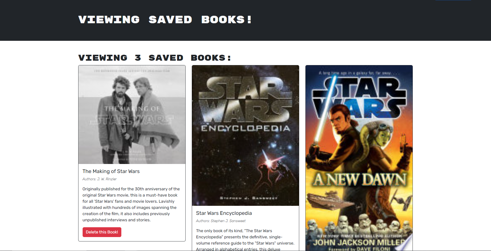

# Book Search Engine  

  ## Description
  I made this app because as an avid reader, I want to search for new books to read, so that I can keep a list of books to purchase. 
  
  
  ## Table Of Contents
  - [Installation](#installation)
  - [Usage](#usage)
  - [License](#license)
  - [How To Contribute](#how-to-contribute)
  - [Tests](#tests)
  - [Credits](#credits)
  - [Questions](#questions)

         
  
  ## Installation
  N/A
  
  ## Usage
  To use this Google Books Search App, please visit https://sleepy-sea-92630-0d95c5fcb6f7.herokuapp.com . If this your first time, sign up for an account. Enjoy!

  Screenshot of Deployed Application: 
  
  
  ## License
  

  License Link: https://opensource.org/licenses/MIT
  
  ## How To Contribute
 Please click [here](https://github.com/fzhao888/Book-Search-Engine) to contribute 
  
  ## Tests
  N/A
  
  ## Credits
  HUGE shout to TA Chris for helping me understand GraphQL and debug this project.

  ## Questions
  If you have any questions, please here is my contact info:

  GitHub:  [fzhao888](https://github.com/fzhao888)

  Email: frank.zhao93@gmail.com